### Part 1. Настройка **gitlab-runner**

##### Подними виртуальную машину *Ubuntu Server 22.04 LTS*.
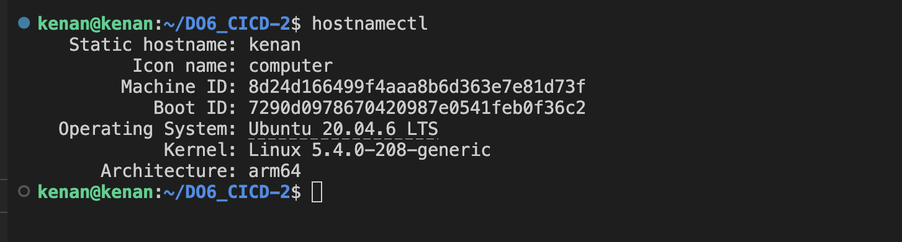
##### Скачай и установи на виртуальную машину **gitlab-runner**.
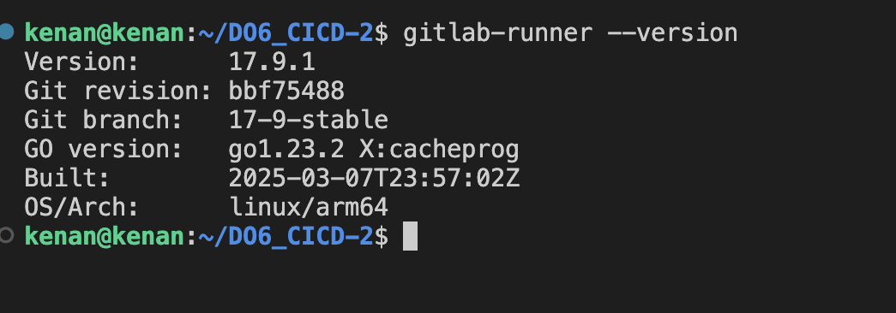

##### Запусти **gitlab-runner** и зарегистрируй его для использования в текущем проекте (*DO6_CICD*).
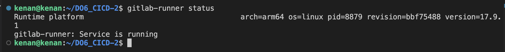

### Part 2. Сборка
Напиши этап для **CI** по сборке приложений из проекта *C2_SimpleBashUtils*.
В файле _gitlab-ci.yml_ добавь этап запуска сборки через мейк файл из проекта _C2_.
Файлы, полученные после сборки (артефакты), сохрани в произвольную директорию со сроком хранения 30 дней.
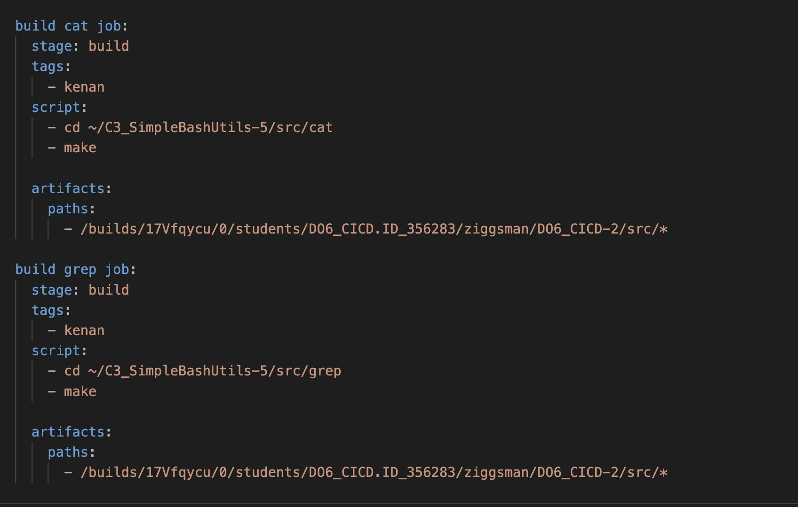
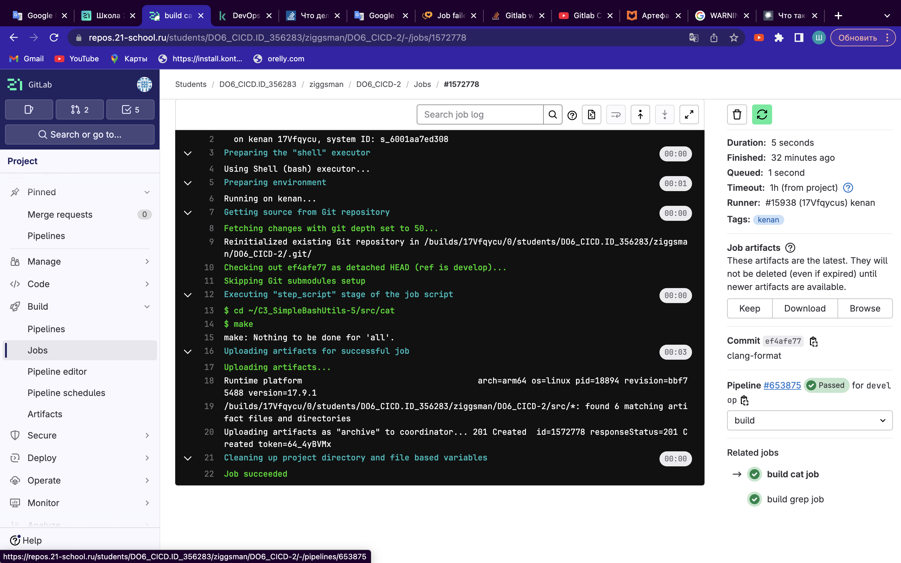
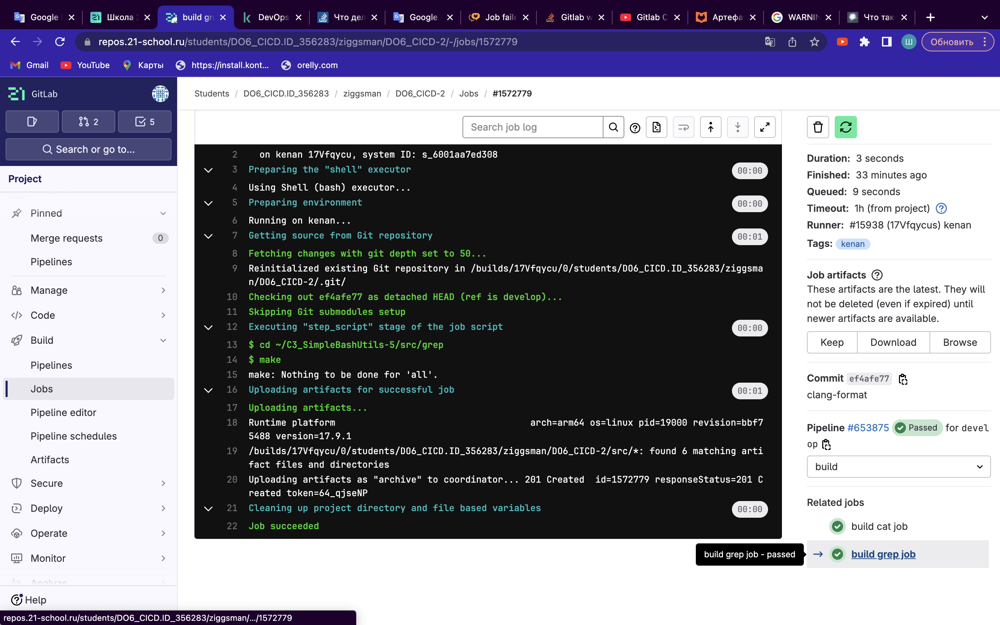

### Part 3. Тест кодстайла
#### Напиши этап для **CI**, который запускает скрипт кодстайла (*clang-format*).
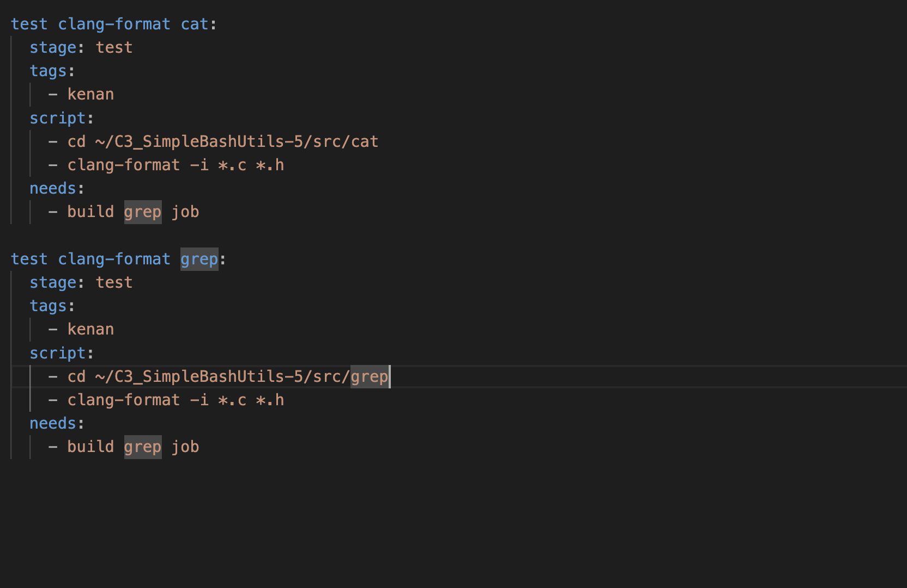
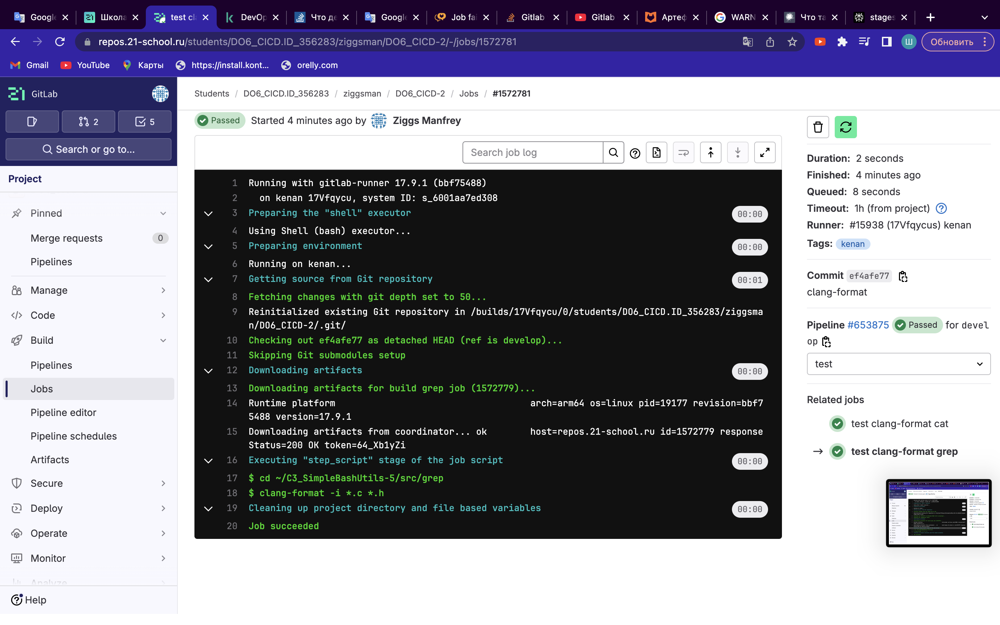
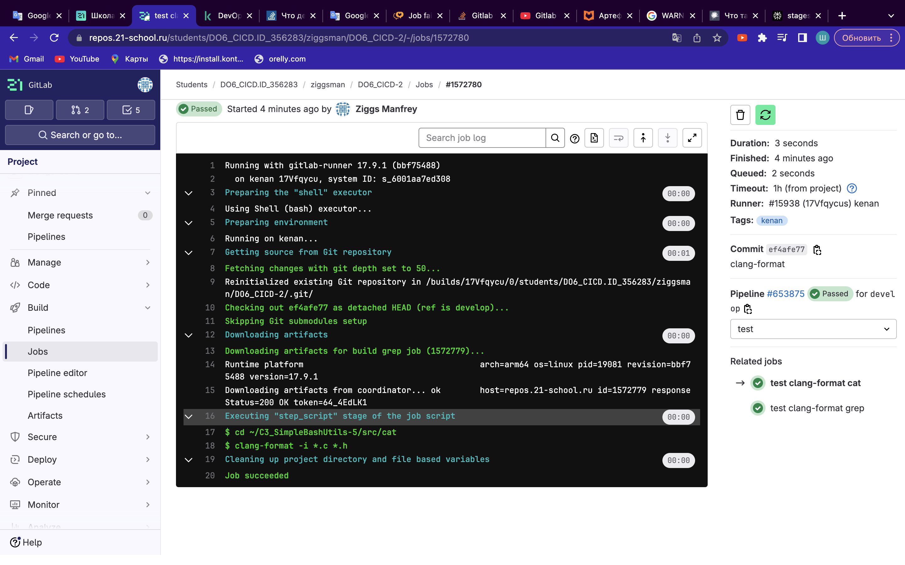

### Part 4. Интеграционные тесты
**== Задание ==**
#### Напиши этап для **CI**, который запустит интеграционные тесты.
##### Для проекта *C2_SimpleBashUtils* можешь взять свои уже написанные интеграционные тесты.
##### Для проекта из папки code-samples напиши интеграционные тесты самостоятельно. Тесты могут быть написаны на любом языке (c, bash, python и т.д.) и должны вызывать собранное приложение для проверки его работоспособности на разных случаях.
##### Запусти этот этап автоматически только при условии, если сборка и тест кодстайла прошли успешно.
##### Если тесты не прошли, то «зафейли» пайплайн.
##### В пайплайне отобрази вывод, что интеграционные тесты успешно прошли / провалились.
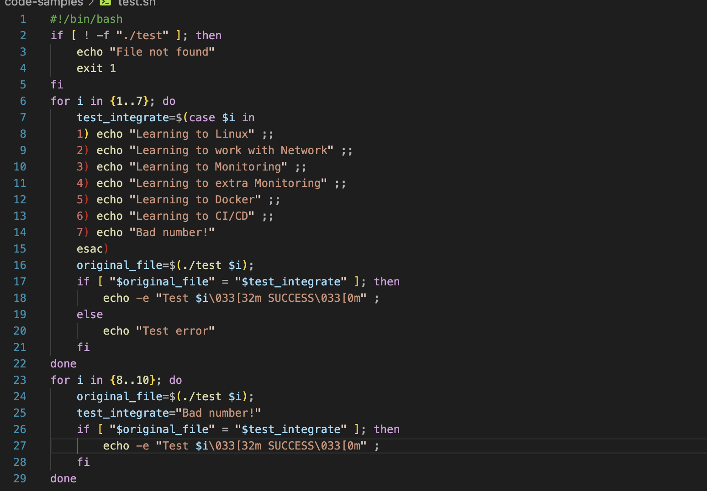
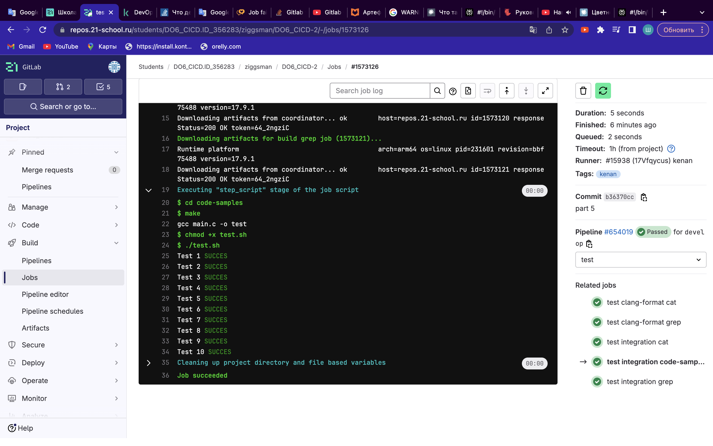
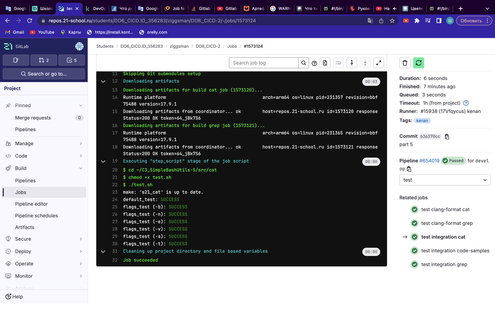

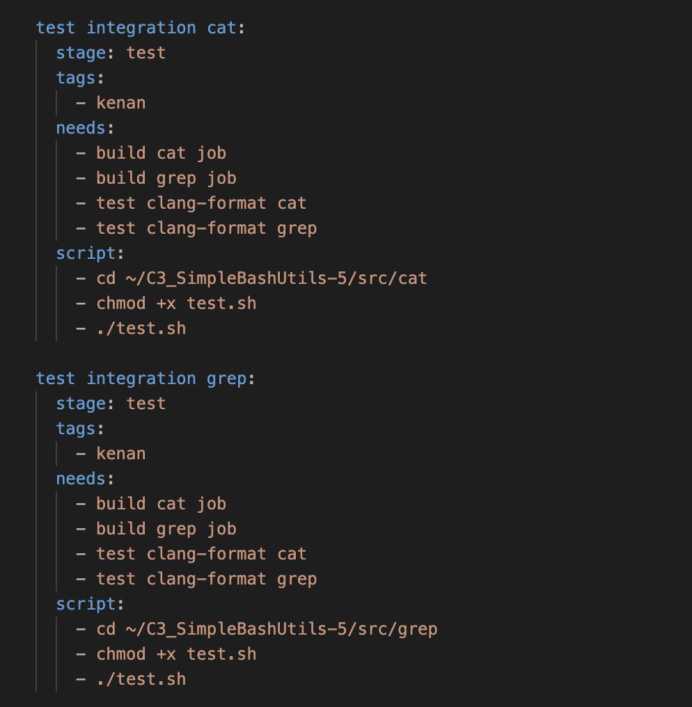
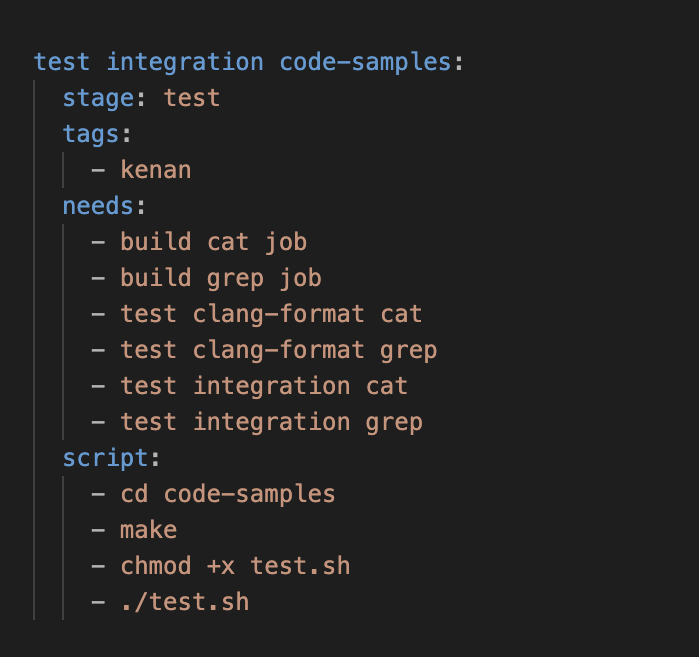

### Part 5. Этап деплоя
**== Задание ==**
##### Подними вторую виртуальную машину *Ubuntu Server 22.04 LTS*.
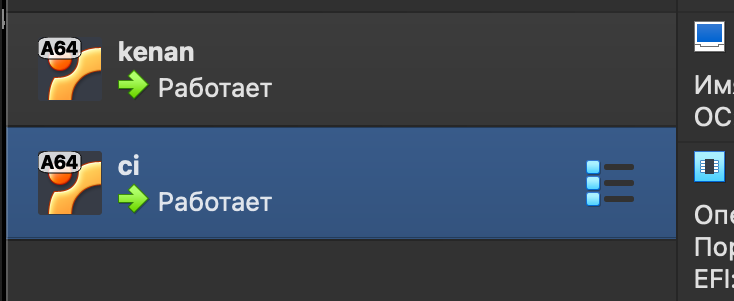
#### Напиши этап для **CD**, который «разворачивает» проект на другой виртуальной машине.
##### Запусти этот этап вручную при условии, что все предыдущие этапы прошли успешно.
##### Напиши bash-скрипт, который при помощи **ssh** и **scp** копирует файлы, полученные после сборки (артефакты), в директорию */usr/local/bin* второй виртуальной машины.
##### В файле _gitlab-ci.yml_ добавь этап запуска написанного скрипта.
##### В случае ошибки «зафейли» пайплайн.
##### Сохрани дампы образов виртуальных машин.
**P.S. Ни в коем случае не сохраняй дампы в гит!**
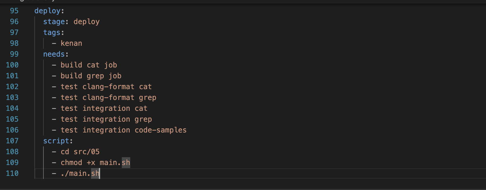
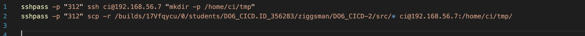
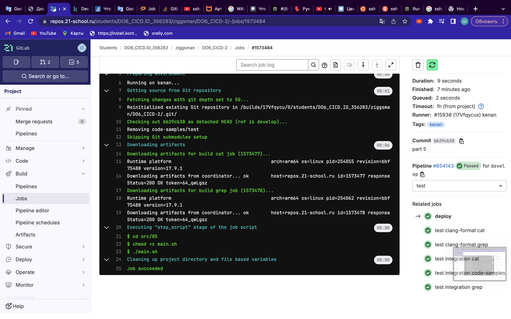
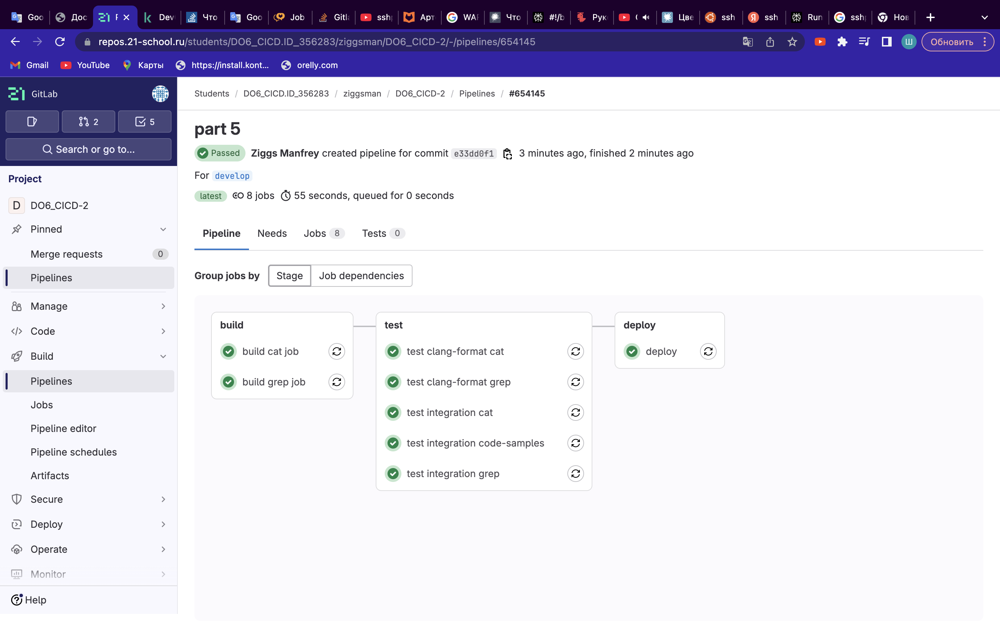

### Part 6. Дополнительно. Уведомления

`-` Здесь написано, что твое следующее задание выполняется специально для нобелевских лауреатов. Здесь не сказано, за что они получили премию, но точно не за умение работать с **gitlab-runner**.

**== Задание ==**

#### Настрой уведомления об успешном/неуспешном выполнении пайплайна через бота с именем «[твой nickname] DO6 CI/CD» в *Telegram*.
- Текст уведомления должен содержать информацию об успешности прохождения как этапа **CI**, так и этапа **CD**.
- В остальном текст уведомления может быть произвольным.

